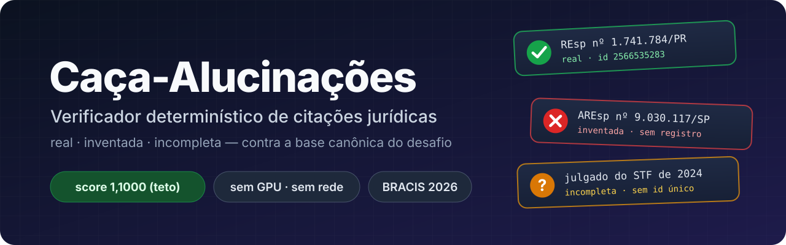

<p align="center">
  
</p>

<p align="center">
  
  
  
  
  
</p>

# Caça-Alucinações — verificador determinístico de citações jurídicas

Solução para o desafio **Caça-Alucinações** (BRACIS 2026 × Jusbrasil): localizar
todas as citações de jurisprudência e de lei em documentos jurídicos e classificar
cada uma como `real`, `inventada` ou `incompleta` contra a base canônica do desafio.

**Autor:** Matheus Vicente Coutinho

## Resultados

Todos os scores foram obtidos com a métrica oficial (`kaggle_metric.py`), sem
modificação. O teto da métrica é **1,1000**.

| conjunto | documentos | citações | score |
|---|---:|---:|---:|
| amostra de desenvolvimento (gabarito final) | 26 | 192 | **1,1000** |
| corpus sintético, semente 7 | 300 | 2.467 | **1,1000** |
| corpus sintético, semente 424242 | 400 | 3.250 | **1,1000** |
| corpus sintético, semente 90210 | 500 | 4.115 | **1,1000** |

Nos dois níveis: macro-F1 = 1,0000, τ = 0 (nenhuma citação inventada classificada
como real) e bônus de calibração de 0,1000.

Além disso, o sistema passa em testes derivados da própria base canônica, que não
dependem da amostra de desenvolvimento:

| teste | casos | resultado |
|---|---:|---:|
| acórdãos da base, com a classe por extenso, por sigla e com ruído de OCR | 1.705 | 100% |
| dispositivos e súmulas em todas as formas de superfície, com controles | 254 | 100% |
| arquivos com CRLF, BOM e acentos decompostos (NFD) | 5 variantes | 1,1000 |

A execução leva cerca de 6 s para os 26 documentos, em CPU, sem GPU, sem rede e
sem modelo neural. A geração da submissão depende de um único pacote externo
(`regex`).

## Reprodução

Requisitos: Python 3.10 ou superior.

```bash
pip install -r requirements.txt
```

Copie o material distribuído pela organização para `dados/` (detalhes em
[`dados/LEIA-ME.md`](dados/LEIA-ME.md)):

```
dados/
├── txt/                    documentos de entrada
├── desafio1_bracis.db      base canônica
├── json_to_submission.py   conversor oficial
├── kaggle_metric.py        métrica oficial
└── goldenset.csv           gabarito (apenas para avaliação)
```

Gere a submissão:

```bash
python gerar_submissao.py                              # documentos em dados/txt
python gerar_submissao.py --txt <pasta_do_conjunto>    # outro conjunto
python gerar_submissao.py --gabarito dados/goldenset.csv   # gera e avalia
python gerar_submissao.py --modelo-ner <pasta_do_modelo>   # + variante com BERTimbau
```

O comando constrói o índice a partir da base (e confirma que coincide byte a byte
com o `indice.json` versionado), executa o extrator, valida o contrato de saída e
converte os JSONs com o conversor oficial. As saídas ficam em `saida/`:

```
saida/
├── submission.csv            submissão principal
├── submission_difusas.csv    variante para a política de anotação anterior
├── submission_bert.csv       variante opcional com o rotulador BERTimbau
├── json_principal/           um JSON por documento (contrato schema 1.2)
└── json_difusas/
```

A variante `submission_bert.csv` só é gerada com `--modelo-ner` e requer as
dependências de `requirements-ml.txt` e os pesos treinados do rotulador. Os
pesos (433 MB) não cabem no repositório e são distribuídos como anexo do
[Release v1.0](https://github.com/sunriseinkyoto/caca-alucinacoes/releases/tag/v1.0), no arquivo `modelo_ner.zip`:

```bash
pip install -r requirements-ml.txt
# extrair modelo_ner.zip na raiz do repositório, criando modelo_ner/
python gerar_submissao.py --modelo-ner modelo_ner
```

O SHA-256 de `modelo_ner/model.safetensors` está nas notas do Release e permite
confirmar que os pesos são os mesmos usados nos resultados publicados. Detalhes
do treino em [`ml/README.md`](ml/README.md).

Para executar a bateria completa de testes (cerca de 4 minutos):

```bash
python testes/executar_testes.py            # completa
python testes/executar_testes.py --rapido   # sem os corpora sintéticos
```

## Submissão

O arquivo enviado ao Kaggle é **`saida/submission.csv`**. Para a amostra de
desenvolvimento, ele coincide byte a byte com o `submission.csv` versionado na
raiz do repositório.

### Política de anotação

Durante o desafio, a política de anotação mudou. A política vigente, comunicada
pela organização em 04/09/2026 e adotada no gabarito final, considera
`incompleta` a referência que identifica uma decisão sem identificador único
(tribunal, ano e relator). Ela não inclui expressões difusas como "jurisprudência
pacífica desta Corte". A política anterior as anotava como `incompleta`. A página
do desafio ainda descreve essa política: 225 citações, 65 delas incompletas.

As duas políticas estão implementadas:

| variante | política | amostra (gabarito final) | amostra (gabarito original) |
|---|---|---:|---:|
| `submission.csv` | vigente | **1,1000** | 0,8746 |
| `submission_difusas.csv` | anterior | 0,9776 | 0,9972 |

A variante difusas reproduz, texto a texto, as 65 incompletas do gabarito
original. Contra aquele gabarito, as duas variantes ficam abaixo do teto por
uma razão independente da política. A versão original da base não trazia
cabeçalho explícito em súmulas e dispositivos, que por isso não podem ser
indexados. Para a decisão, o que importa é a diferença entre as variantes em
cada gabarito: cerca de 0,12 a favor da política correta.

Apostar na política errada custa cerca de 0,12 nos dois sentidos, e a confiança
não reduz esse custo: uma predição sem par conta como falso positivo, qualquer
que seja sua confiança. A recomendação para o conjunto de avaliação é submeter as
duas variantes quando ele for publicado. A parte pública do leaderboard (40%)
segue a mesma política de anotação da parte privada (60%). Assim, o maior score
público identifica a política, e a escolha não constitui ajuste ao conjunto de
teste. Na ausência dessa informação, a variante principal segue a política
vigente e é a escolha padrão.

### Variante com BERTimbau

A variante `submission_bert.csv` acrescenta à principal os spans do rotulador
BERTimbau em trechos onde as regras não encontraram nada. Com as regras
completas, ela coincide com a principal: na amostra de desenvolvimento, a saída
é idêntica byte a byte. O valor dela está no conjunto de avaliação, se ele
trouxer formatos de citação que as regras não reconhecem: nos testes, a fusão
mantém 1,1000 mesmo quando as regras perdem todas as citações. O comando informa
quantos spans o rotulador acrescentou:

- **nenhum**: as duas variantes são iguais, e não há o que decidir;
- **algum**: a comparação entre `submission.csv` e `submission_bert.csv` na
  parte pública do leaderboard indica se os acréscimos são citações legítimas.

## Abordagem

A base canônica é um conjunto **fechado** de 1.014 registros (996 acórdãos,
5 súmulas e 13 dispositivos). Isso transforma a tarefa: em vez de recuperação
semântica, ela passa a ser *parsing*, normalização e casamento exato de
identificadores. O pipeline é determinístico:

1. **Índice em duas camadas** (`src/indexar.py`). A camada primária associa cada
   registro ao número do **próprio** processo, lido do cabeçalho com uma regra por
   tribunal. No TST, por exemplo, o número aparece na fórmula "Vistos, relatados
   e discutidos estes autos de … nº TST-…". A camada secundária guarda os demais
   números do cabeçalho. Uma busca no texto integral devolveria todo acórdão que
   *menciona* o número; só o cabeçalho identifica o processo.
2. **Varredura de números tolerante a OCR** (`src/extrair.py`). A detecção ancora
   no número — o componente que o ruído preserva, dada a garantia de que um
   dígito nunca é trocado por outro — e expande à esquerda sobre a classe
   processual. Letras de OCR cercadas por dígitos são convertidas
   (`1.45g.779` → 1459779), e números fragmentados por espaço, ponto ou quebra de
   linha são reconstruídos.
3. **Dispositivos e súmulas.** O nome do diploma é comparado por distância de
   edição, o que tolera `Consurnidor` e `Fedcral`, mas os dígitos do diploma
   exigem igualdade exata. Nomes que prosseguem além do apelido reconhecido
   ("Constituição Estadual") são tratados como outro diploma. As duas regras
   impedem que uma citação sem registro seja classificada como `real`.
4. **Citações vagas.** Padrões com tolerância a erros de edição, ancorados em
   literais curtos para manter o custo baixo.
5. **Distratores.** Linhas de autuação do cabeçalho (número dos autos, protocolo,
   OAB, folhas) são descartadas, inclusive com rótulos corrompidos por OCR
   ("Rcferência", "Auto5").
6. **Offsets exatos** (`src/texto.py`). O texto é processado em forma normalizada
   (LF, sem BOM, NFC), e os spans são mapeados de volta para os codepoints do
   arquivo como distribuído.
7. **Confiança 1,0.** O teto de 1,1000 exige Brier = 0. Com acurácia *a*, a perda
   máxima dessa escolha em relação à melhor confiança constante é 0,10·(1−a)²:
   0,00025 a 95% de acurácia. O modo `--confianca calibrada` está disponível.

## Garantias de robustez

O conjunto de avaliação é cego. As garantias de robustez vêm de testes que não
dependem da amostra de desenvolvimento:

- **Cobertura da base** (`testes/teste_cobertura_base.py`). Toda citação `real`
  do conjunto cego resolve, por construção, para um registro da base. Por isso, o
  teste reconstrói a citação de **cada acórdão** a partir do seu cabeçalho e a
  escreve por extenso, por sigla e com ruído de OCR. Esse teste revelou lacunas
  de vocabulário: "Recurso Extraordinário **com** Agravo", "Embargos Infringentes
  e de Nulidade", `RO`, `AREspe`. Revelou também a perda de detecção quando a
  classe sofre OCR ("Reclarnação": de 37% para 100% de cobertura nessa escrita).
- **Cobertura de normas** (`testes/teste_cobertura_normas.py`). Cobre os 13
  dispositivos e as súmulas em todas as formas ("art. 373, I, do CPC", "artigo
  373, inciso I, do Código de Processo Civil", "Lei nº 13.105/2015", "CRFB/88",
  "Súmula 83/STJ", "5úrnula"). Inclui controles: artigo inexistente deve resultar
  em `inventada`; diploma fora da base nunca pode resultar em `real`.
- **Codificação** (`testes/teste_codificacao.py`). Com quebras de linha CRLF, a
  leitura padrão de texto do Python deslocava todos os offsets, e o score caía
  para 0,0946 sem aviso.
- **Corpora sintéticos** (`testes/teste_sintetico.py`). Três sementes fixas, que
  não são usadas para ajustar o sistema.

## Estrutura do repositório

```
gerar_submissao.py        ponto de entrada: documentos -> submission.csv
indice.json               índice da base canônica (reprodutível a partir da base)
templates.json            blocos de texto extraídos da amostra de desenvolvimento
submission.csv            submissão da amostra de desenvolvimento
src/
  indexar.py              construção do índice
  extrair.py              extração, classificação e resolução
  texto.py                leitura com preservação exata de offsets
  rodar.py                execução do pipeline sobre uma pasta
  validar.py              validação do contrato de saída
  avaliar_oficial.py      avaliação com a métrica oficial
  analisar_erros.py       relatório de erros por tipo
  alinhamento.py          alinhamento por IoU para diagnóstico
  calibrar.py             calibração da confiança por tipo de evidência
testes/                   bateria de testes (executar_testes.py)
ml/                       componente experimental (não integra a submissão)
assets/                   imagens do README
dados/                    material da organização (não versionado)
```

## Componente de aprendizado de máquina

O diretório `ml/` reúne os experimentos com modelos. A submissão principal não
usa nenhum deles; o rotulador BERTimbau está disponível como variante opcional
(`--modelo-ner`). Os resultados completos estão em [`ml/README.md`](ml/README.md):

| componente | estado | resultado medido |
|---|---|---|
| corpus sintético | executado | revelou oito defeitos reais; é a base do teste sintético |
| rotulador de spans BERTimbau | treinado (3 épocas, 70,5 min de CPU); variante opcional | P = 0,9948 e R = 1,0000 nos 26 documentos reais, sem documento real no treino. Com o critério de fusão estrito, 1,1000 em qualquer fração de citações perdidas pelas regras, de 0% a 100%, no dev e em 5.717 citações sintéticas inéditas. Sozinho, com o resolvedor, também atinge o teto |
| calibração por regressão logística | executado | Brier de 0,0102 para 0,0051; +0,0005 no score |
| perplexidade do Manacá-1B | implementado, não executado | contribuição máxima nula: o bônus de calibração já está no teto |

## Conformidade com as regras

- Apenas ferramentas de código aberto. A submissão não usa modelo, API paga
  nem acesso à rede.
- O conversor oficial (`json_to_submission.py`) e a métrica oficial
  (`kaggle_metric.py`) são usados sem modificação.
- As saídas são determinísticas e reprodutíveis a partir de um clone limpo. O
  índice reconstruído coincide byte a byte com o versionado, e o `submission.csv`
  da amostra de desenvolvimento é reproduzido byte a byte pela bateria de testes.

## Licença

Distribuído sob a licença MIT (ver [`LICENSE`](LICENSE)). O material da
organização (documentos, base canônica, gabarito, conversor e métrica) não faz
parte deste repositório e segue os termos do desafio.
